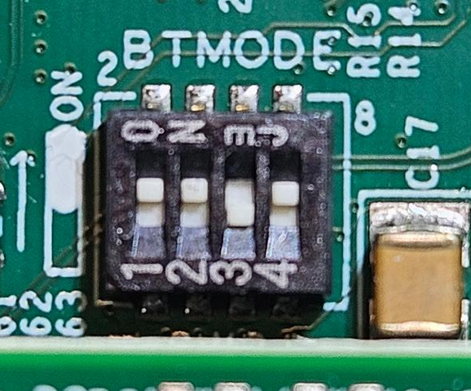
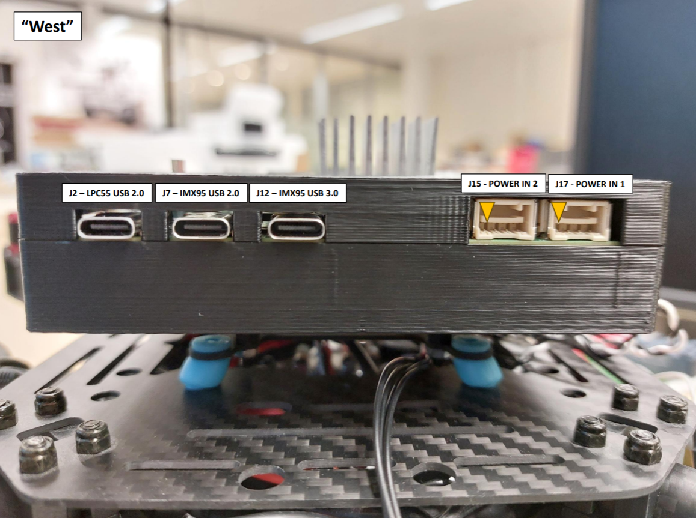

NavQ95
======

The [IMX yocto project users guide](https://www.nxp.com/docs/en/user-guide/IMX_YOCTO_PROJECT_USERS_GUIDE.pdf) contains 
detailed explanation on how to an build SD card image for the various iMX devices. For the NavQ95 there are a few exception that need to be taken 
care of.

See below table containing items that deviate from the manual:

| Item                   | Original                                    | New                                               |
| -----------------------| ------------------------------------------- | ------------------------------------------------- |
| imx-manifest repo URL  | https://github.com/nxp-imx/imx-manifest.git | https://github.com/NXPHoverGames/imx-manifest-navq95-private.git |
| Manifest file          | imx-6.6.23-2.0.0.xml                        | imx-6.6.23-2.0.0-navq.xml                         |
| Machine                | * (eg. imx95-19x19-lpddr5-evk)              | imx95-19x19-navqdesktop                           |

For a NavQ95 specific explanation refer to the [Build SD card image](#build-sd-card-image) and the [Flash image to SD card](#flash-image-to-sd-card) paragraphs on this page.

There is no M7 software included in the image build by yocto and instead this is placed into NOR flash of the NavQ95. This should
be [built](#build-nor-flash-image) and [flashed](#flash-nor-flash-image) to the NOR flash manually.

Both SD card and NOR flash need the correct images for the NavQ95 to work properly.

<a name="build-sd-card-image"></a>

Build SD card image
-------------------

Sync repositories by manifest:
```bash
mkdir imx-yocto-bsp
cd imx-yocto-bsp
repo init -u git@github.com:NXPHoverGames/imx-manifest-navq95-private.git -b imx-linux-scarthgap -m imx-6.6.23-2.0.0-navq.xml
repo sync
```

Setup build:
```bash
MACHINE=imx95-19x19-navqdesktop DISTRO=imx-desktop-xwayland source imx-setup-release.sh -b build-95-full
```

Optionally add below lines to conf/local.conf in case the host should stay responsive
```bash
BB_NUMBER_THREADS = "6"
PARALLEL_MAKE = "-j 5"
```

Start build:
```bash
bitbake imx-image-mr
```
Or to start build and immediately detach the process from the console (may be convenient since this build may take a while)
```bash
nohup bitbake imx-image-mr &
```

To build an image with ROS2 preinstalled:
```bash
bitbake imx-image-ros
```

<a name="flash-image-to-sd-card"></a>

Flash image to SD card
----------------------

To flash the yocto image to an SD card use the command below. Make sure you update the output file ```of=/dev/sdX``` to the block device that belong to the SD card.
```bash
cd /path/to/imx-yocto-bsp/build-95-full
zstdcat tmp/deploy/images/imx95-19x19-navq/imx-image-desktop-imx95-19x19-navq.rootfs.wic.zst | sudo dd of=/dev/sdX bs=1M conv=fsync
```

<a name="build-nor-flash-image"></a>

Build NOR flash image
---------------------

The M7 core runs the PX4 autopilot software and this need to be stored on the NOR flash.

Then clone the PX4 software and checkout the imx95-m7 branch:
```bash
git clone git@github.com:NXPHoverGames/PX4-Autopilot-NXP.git -b imx95-m7 --recursive
```

Make sure your build environment is configured properly. See [PX4 guide](https://docs.px4.io/main/en/dev_setup/dev_env_linux_ubuntu.html) for more information.
In short, running this script will install all build dependencies:
```bash
bash ./PX4-Autopilot-NXP/Tools/setup/ubuntu.sh
```

Then build the nxp_imx95_default target:
```bash
cd PX4-Autopilot-NXP
make nxp_imx95_default
```

<a name="flash-nor-flash-image"></a>

Flash NOR flash image
---------------------

Install pyocd to flash the image through the on-board JTAG device.
This is tested with python 3.10 but python 3.9 should suffice.

Clone pyocd into a directory of your preference and checkout the imx95 branch:
```bash
git clone git@github.com:NXPHoverGames/pyocd-private.git -b imx95
```

Build pyocd:
```bash
cd pyocd-private
python3 -m pip install .
```

Make sure the DIP switches are correctly configured as described in [Power up](#power-up-navq95).
Remove any SD card and connect the Debug USB port (J2) to your host. Then apply 12V to the J15 connector to power up the board. Make sure to do this in the given order.

Run below command to flash the PX4 software to the NOR flash:
```bash
cd /path/to/PX4-Autopilot
pyocd flash -t mimx95_cm33 ./build/nxp_imx95_default/nxp_imx95_default.bin -f 10m
```

:warning: Writing to NOR flash is not completely stable yet. Retry the pyocd flash command until pyocd displays it had only programmed 0 pages.


<a name="power-up-navq95"></a>

Power up NavQ95
===============

Before powerering up the NavQ95 make sure the DIP switches have the correct settings. They must be configured like the image below.



Insert the SD card with the image installed. Connect the Debug USB port (J2) to your host. Then apply 12V to the J15 connector to power up the board.

:warning: Currently it is important to connect the USB and power supply in that order. Otherwise the board won't completely power up. This can be fixed in software and will probably happen soon.



The USB port gives access to the tty's of linux and PX4/NuttX.

The default linux user is 'user' (password: 'user')

:warning: PX4 filesystem depends the /px4 directory on the linux root fs. Currently this is not automatically created by the yocto build.
          Create this directory by this command on linux:
          ```
          sudo mkdir /px4
          ```
